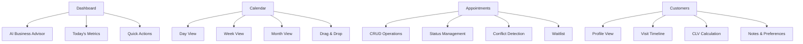

# Aurora — Growth Operating System for Appointment-Based Businesses

> **Current Phase:** Sprint 0 — Planning & Foundation  
> **Target Launch:** Week 22 (Pilot with 3 businesses)  
> **Version:** 1.0.0

---

## 📖 Table of Contents

- [Overview](#overview)
- [Product Vision](#product-vision)
- [Features](#features)
- [Technology Stack](#technology-stack)
- [Getting Started](#getting-started)
- [Development](#development)
- [Documentation](#documentation)
- [Project Status](#project-status)
- [Roadmap](#roadmap)
- [Contributing](#contributing)
- [License](#license)

---

## Overview

Aurora is a premium SaaS platform built for appointment-based businesses such as **salons**, **dermatology clinics**, **aesthetic centers**, and more.

**Aurora is NOT appointment software.**  
**Aurora is a Growth Operating System.**

It helps business owners answer three questions every day:

1. **What needs my attention today?**
2. **Where am I losing money?**
3. **What action should I take next?**

### Why Aurora?

| Problem | Impact | Aurora Solution |
|---------|--------|-----------------|
| Empty weekday afternoons | ₹50K-1L/week lost | AI detects empty slots, suggests campaigns |
| No-shows | 15-25% revenue loss | WhatsApp auto-reminders & confirmations |
| Poor customer retention | 40% lost after 2 visits | Automated re-engagement & birthday offers |
| Manual admin work | 15+ hours/week wasted | Digital operations & automation |
| No business visibility | Reactive decisions | Real-time dashboard & AI insights |

---

## Product Vision

### Mission
> **"Aurora helps local businesses grow by transforming how they operate, retain customers, and make decisions."**

### Product Principles
- **Beauty is a Feature** — Premium interface builds trust and satisfaction
- **Speed is Trust** — Every interaction should feel instant
- **AI as Assistant** — Recommends actions, never replaces user control
- **Progressive Complexity** — Simple for beginners, powerful for experts
- **Build Trust, Not Lock-in** — Value keeps customers, not contracts

### Target Market
**Primary (MVP):**
- Salons & Beauty Studios
- Dermatology Clinics
- Aesthetic Centers

**Future:**
- Physiotherapists
- Dental Clinics
- Pet Grooming
- Coaching Centers
- Wellness Studios

---

## Features

### Core Modules

| Module | Status | Description |
|--------|--------|-------------|
| **Dashboard** | 🚧 Sprint 5 | Business owner's morning briefing with AI insights |
| **Calendar** | 🚧 Sprint 2 | Beautiful, drag-and-drop scheduling |
| **Appointments** | 🚧 Sprint 3 | Full appointment management with status tracking |
| **Customers** | 🚧 Sprint 4 | Complete customer profiles with visit history |
| **Staff** | 🚧 Sprint 2 | Staff management with schedule & performance |
| **Services** | ✅ Sprint 2 | Service catalog with pricing & duration |
| **Billing** | 🚧 Sprint 6 | Invoice generation & payment tracking |
| **Reports** | 🚧 Sprint 7 | Actionable business insights |
| **Online Booking** | 🚧 Sprint 8 | Public booking page for customers |
| **WhatsApp** | 🚧 Sprint 9 | Automated confirmations & reminders |
| **AI Engine** | 🚧 Sprint 10 | Opportunity detection & campaign suggestions |

### Key Capabilities



---

## Technology Stack

### Frontend

| Technology | Version | Purpose |
|------------|---------|---------|
| **React** | 19.x | UI Framework |
| **TypeScript** | 5.x | Type Safety |
| **Vite** | 5.x | Build Tool |
| **Tailwind CSS** | 3.x | Styling |
| **shadcn/ui** | Latest | Component Library |
| **TanStack Query** | 5.x | Server State |
| **React Hook Form** | 7.x | Form Management |
| **Zod** | 3.x | Validation |
| **React Router** | 6.x | Routing |

### Backend

| Technology | Version | Purpose |
|------------|---------|---------|
| **ASP.NET Core** | 8.x | Web API Framework |
| **Entity Framework Core** | 8.x | ORM |
| **PostgreSQL** | 15+ | Database |
| **JWT** | - | Authentication |
| **BCrypt** | - | Password Hashing |
| **FluentValidation** | 11.x | Validation |
| **Serilog** | - | Structured Logging |

### Infrastructure

| Technology | Purpose |
|------------|---------|
| **Docker** | Containerization |
| **Docker Compose** | Local Development |
| **AWS/Azure** | Cloud Deployment |
| **GitHub Actions** | CI/CD |

---

## Getting Started

### Prerequisites

- Node.js 20+
- .NET 8 SDK
- PostgreSQL 15+
- Docker (optional)

### Local Development Setup

#### 1. Clone the Repository

```bash
git clone https://github.com/your-username/aurora.git
cd aurora
```

#### 2. Backend Setup

```bash
cd apps/api
dotnet restore
dotnet ef database update
dotnet run
```

The API will be available at `https://localhost:5000`

#### 3. Frontend Setup

```bash
cd apps/web
npm install
npm run dev
```

The frontend will be available at `http://localhost:5173`

#### 4. Docker Setup (Optional)

```bash
docker-compose up -d
```

### Environment Variables

#### Backend (`apps/api/appsettings.Development.json`)

```json
{
  "ConnectionStrings": {
    "Default": "Host=localhost;Database=aurora;Username=postgres;Password=postgres"
  },
  "Jwt": {
    "Secret": "your-super-secret-key",
    "Issuer": "https://localhost:5000",
    "Audience": "https://localhost:5000"
  },
  "Twilio": {
    "AccountSid": "your-twilio-sid",
    "AuthToken": "your-twilio-token",
    "WhatsAppNumber": "whatsapp:+14155238886"
  }
}
```

#### Frontend (`apps/web/.env`)

```env
VITE_API_URL=http://localhost:5000/api/v1
VITE_WHATSAPP_BOOKING_API_KEY=your-key
```

---

## Development

### Project Structure

```
aurora/
├── apps/
│   ├── api/                    # .NET 8 Backend
│   │   ├── src/
│   │   │   ├── Features/      # Feature-based modules
│   │   │   ├── Shared/        # Shared infrastructure
│   │   │   └── Program.cs
│   │   └── tests/             # Unit & Integration tests
│   └── web/                    # React Frontend
│       ├── src/
│       │   ├── app/           # Routing & Layouts
│       │   ├── features/      # Feature-based modules
│       │   ├── shared/        # Shared components & hooks
│       │   └── App.tsx
│       └── tests/             # Unit & E2E tests
├── docs/                       # Documentation
├── scripts/                    # Development scripts
├── docker-compose.yml          # Docker Compose configuration
└── README.md
```

### Architecture

Aurora uses a **Modular Monolith** with **Clean Architecture** principles and **Vertical Slice Architecture** for feature implementation.

```
┌─────────────────────────────────────────────────────────────┐
│                    Presentation (React)                     │
├─────────────────────────────────────────────────────────────┤
│                       API Layer (.NET)                      │
├─────────────────────────────────────────────────────────────┤
│                    Application Layer                        │
│              (Use Cases, DTOs, Validators)                  │
├─────────────────────────────────────────────────────────────┤
│                      Domain Layer                           │
│           (Entities, Value Objects, Events)                 │
├─────────────────────────────────────────────────────────────┤
│                   Infrastructure Layer                      │
│           (Repositories, Services, Context)                 │
├─────────────────────────────────────────────────────────────┤
│                      Database (PostgreSQL)                  │
└─────────────────────────────────────────────────────────────┘
```

### Coding Standards

#### Naming Conventions

| Element | Convention | Example |
|---------|-----------|---------|
| Components | PascalCase | `AppointmentCard` |
| Hooks | use + PascalCase | `useAppointments` |
| Functions | camelCase | `createAppointment` |
| Constants | UPPER_SNAKE_CASE | `MAX_APPOINTMENTS` |
| Types | PascalCase | `AppointmentStatus` |
| Files | kebab-case | `appointment-card.tsx` |
| Classes | PascalCase | `AppointmentService` |

#### Commit Conventions

```
feat: New feature
fix: Bug fix
docs: Documentation changes
style: Code style changes
refactor: Code refactoring
test: Test changes
chore: Build process changes
```

Example: `feat: add drag-and-drop to calendar`

---

## Documentation

| Document | Description |
|----------|-------------|
| [PRODUCT.md](./docs/PRODUCT.md) | Complete PRD with vision, strategy & specifications |
| [DESIGN.md](./docs/DESIGN.md) | Design system with tokens, components & UI guidelines |
| [ARCHITECTURE.md](./docs/ARCHITECTURE.md) | Technical architecture & engineering guidelines |
| [ROADMAP.md](./docs/ROADMAP.md) | Development roadmap with sprints & milestones |
| [IDEAS.md](./docs/IDEAS.md) | Future ideas & product enhancements |

### Quick Links

- [PRD Part 1 — Vision & Strategy](./docs/PRODUCT.md#1-executive-summary)
- [PRD Part 2 — Functional Specifications](./docs/PRODUCT.md#7-module-specifications)
- [PRD Part 3 — Engineering Requirements](./docs/PRODUCT.md#8-engineering-requirements)
- [Design Tokens](./docs/DESIGN.md#20-design-tokens)
- [API Endpoints](./docs/ARCHITECTURE.md#11-api-design)
- [Database Schema](./docs/ARCHITECTURE.md#10-database-design)

---

## Project Status

### Current Sprint: Sprint 0 — Planning & Foundation 🚧

**Progress:** 0% Complete

| Sprint | Feature | Status | Target |
|--------|---------|--------|--------|
| 0 | Planning & Foundation | 🚧 In Progress | Week 1 |
| 1 | Design System | 📋 Planned | Week 2 |
| 2 | Calendar & Staff | 📋 Planned | Weeks 3-4 |
| 3 | Appointments | 📋 Planned | Weeks 5-6 |
| 4 | Customers | 📋 Planned | Weeks 7-8 |
| 5 | Dashboard | 📋 Planned | Week 9 |
| 6 | Billing | 📋 Planned | Weeks 10-11 |
| 7 | Reports | 📋 Planned | Week 12 |
| 8 | Online Booking | 📋 Planned | Weeks 13-14 |
| 9 | WhatsApp Automation | 📋 Planned | Weeks 15-16 |
| 10 | AI Opportunity Engine | 📋 Planned | Weeks 17-18 |
| 11 | Polish & Pilot | 📋 Planned | Weeks 19-20 |

### Feature Status Legend

| Icon | Status |
|------|--------|
| ✅ | Completed |
| 🚧 | In Progress |
| 📋 | Planned |
| ⏳ | Backlog |
| ❌ | Not Planned |

---

## Roadmap

### Phase 1: Foundation (Weeks 1-4)

| Week | Backend | Frontend |
|------|---------|----------|
| 1 | .NET 8 API, PostgreSQL, Auth | React setup, Tailwind, shadcn/ui |
| 2 | Repository pattern, Multi-tenancy | Routing, API client, Login |
| 3-4 | Calendar service, Staff management | Calendar views, Staff pages |

### Phase 2: Core Features (Weeks 5-12)

| Week | Focus | Features |
|------|-------|----------|
| 5-6 | Appointments | CRUD, status, drag & drop |
| 7-8 | Customers | Profiles, history, CLV |
| 9 | Dashboard | Metrics, AI insights |
| 10-11 | Billing | Invoices, payments, PDF |
| 12 | Reports | Revenue, appointments, staff |

### Phase 3: AI & Automation (Weeks 13-18)

| Week | Focus | Features |
|------|-------|----------|
| 13-14 | Online Booking | Public booking, availability |
| 15-16 | WhatsApp | Confirmations, reminders |
| 17-18 | AI Engine | Empty slots, inactive customers |

### Phase 4: Launch (Weeks 19-22)

| Week | Focus | Features |
|------|-------|----------|
| 19-20 | Polish | Performance, security, UI |
| 21-22 | Pilot | 3 businesses, feedback, fixes |

---

## Contributing

### Development Process

1. **Fork** the repository
2. **Create** a feature branch (`git checkout -b feature/amazing-feature`)
3. **Commit** your changes (`git commit -m 'feat: add amazing feature'`)
4. **Push** to the branch (`git push origin feature/amazing-feature`)
5. **Open** a Pull Request

### Pull Request Requirements

- [ ] Code follows style guidelines
- [ ] Tests pass
- [ ] Documentation updated
- [ ] No TODOs remain
- [ ] PR description explains changes
- [ ] Linked to issue/feature

### Issue Reporting

When reporting issues, please include:

- **Issue type:** Bug, Feature, Question
- **Description:** What happened vs. expected
- **Steps to reproduce:** (for bugs)
- **Screenshots:** (if applicable)
- **Environment:** OS, browser, version

---

## Testing

### Running Tests

#### Backend Tests

```bash
cd apps/api
dotnet test
```

#### Frontend Tests

```bash
cd apps/web
npm test
```

#### E2E Tests

```bash
npm run test:e2e
```

### Test Coverage Goals

| Type | Target |
|------|--------|
| Unit Tests | 70%+ |
| Integration Tests | Critical paths |
| E2E Tests | Core user flows |

---

## Performance Goals

| Metric | Target |
|--------|--------|
| Dashboard Load | < 3 seconds |
| Page Navigation | < 1 second |
| Appointment Search | < 500ms |
| Calendar Render | < 2 seconds |
| API Response (p95) | < 200ms |
| Uptime | 99.5% |

---

## Security

### Authentication
- JWT with refresh tokens
- BCrypt password hashing
- Session expiration (24h)

### Authorization
- Role-based access (Owner, Manager, Receptionist, Staff)
- Tenant-level isolation
- Audited actions

### Data Protection
- HTTPS in production
- Encrypted at rest
- GDPR compliant
- Audit logging

---

## License

This project is proprietary software. All rights reserved.

---

## Support

- **Documentation:** [./docs](./docs)
- **Issues:** [GitHub Issues](https://github.com/your-username/aurora/issues)
- **Email:** support@aurora.app
- **Discord:** [Join our community](https://discord.gg/aurora)

---

## Acknowledgments

- **shadcn/ui** — Beautiful component library
- **TanStack** — Excellent React tools
- **Vite** — Fast build tool
- **.NET Community** — Robust backend framework

---

## Project Status Badges


---

*"Aurora exists to help local businesses grow. Every feature must save time, make money, or reduce stress."*

---

**Last Updated:** May 2026  
**Maintainer:** Aurora Team  
**Website:** [aurora.app](https://aurora.app)